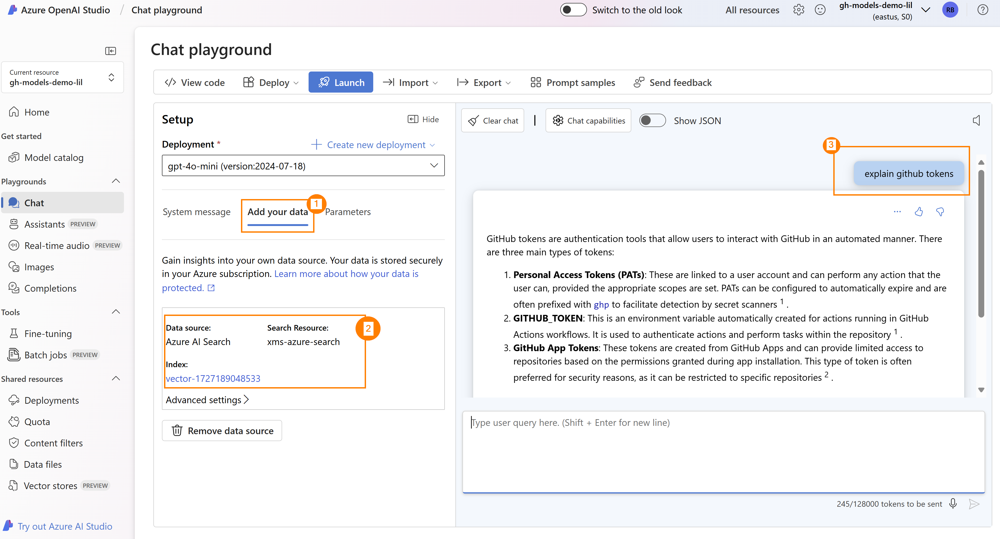

#### Step 5: Query the Azure OpenAI model using Azure Search

Since we have uploaded the markdown data of the blog into Azure Blob Storage, and we have an Azure Search to index the data, we can now prompt the Azure OpenAI model and point it to use the Azure AI Search for the document embeddings:

1. Select "use your own data" to configure the use of your Azure AI Search resource.
1. Validate the resource you have used.
1. Select the prompt to search in your documents.

> [[NOTE]]
> The bottom of the screen will have a list of references that you can use to validate the documents that where found.